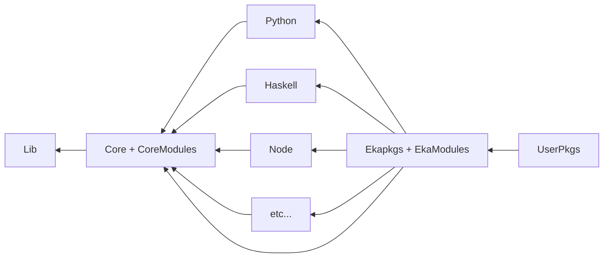

# Ekapkgs poly-repo Nixpkgs fork "Nixpkgs for mortals"

Why? Although a single mono-repo makes it easy for dealing with issues which
span many language ecosystems or subtle software interactions, it also causes
many maintenance issues. Issues like commit access giving "too much power", high
noise to signal ratio in issues and PRs for contributors, and other issues makes
it difficult to maintain nixpkgs from a human perspective.

In particular, this fork tries to address the following issues:
- Process iteration: Replacing slow RFC process with more [empowering improvement process (EEPs)](https://github.com/ekala-project/eeps)
- Usability: Nixpkgs is plagued with a large number of "poor user experiences", there will be conscious efforts to remedy these scenarios
- Repository/VCS size: Mitigated by having the large package sets reside in respective repository locations
- Extensibility: Provide abstractions which make extending the package set with personal or business software easier
- Modern official CI tooling: Make managing your personal or business package sets easier with first class CI/CD solutions
- Documentation: Clear and concise official documentation for onboarding to Nix+ekapkgs, as well as stellar reference documentation
- Small polished core package set system modules:
  - Cheaper pkgs and module evaluation
  - No staging workflow (changes go to master, instead of a 2-4 week long workflow)
  - All builds must successfully build, never worry that something is broken

## Basic repository overview

Repositories will be structured in a way where the most impactful packages
can reside in the "core" repository. From this core, language
ecosystem packages and other package ecosystems can branch off of core and these
"vertical slices" can be curated independently from the others. The `pkgs` repository
allows for all of these packages to be recombined through overlays into a single package set similar
to nixpkgs. The `user-pkgs` overlay will allow for semi-official user packages to
be added, and greater freedom for individuals to contribute their additions with
less emphasis on dogmatic best practices.

## Repository descriptions

All repositories will be Nix 2.3 compatible, with optional flake.nix entry points.

- [x] [Standalone Lib](https://github.com/ekala-project/nix-lib):
  - nixpkgs/lib but reduced to just nix utilities
  - lib.systems is moved to corepkgs repo
  - lib.maintainers and lib.teams moved to core
- [x] [Core Repo](https://github.com/ekala-project/corepkgs):
  - Targeting "development and deployment" scenarios
  - Provides the stdenv.mkDerivations (e.g. buildPythonPackage) helpers
  - Provides a few thousand of the most common development dependencies
    - Desire here is to provide the 20% of packages which are used 80% of the time
  - Bootstrap language ecosystem package sets
  - Contains maintainer information
- [ ] Language package sets:
  - Contain a top-level overlay and `overrideScope` of the package set with richer set of packages
  - [x] [Python](https://github.com/ekala-project/python-pkgs)
- [ ] Pkgs:
  - Targeting "User desktop" scenarios, most software will be available here
  - Combines all of the language package set overlays
  - Acts as the "backstop" for all packages which have "trickier" dependency requirements
- [ ] User-pkgs:
  - The NUR/"AUR" equivalent
  - Allows for people getting started with Nix to share expressions in a semi-centralized manner
  - Linting and basic concerns for code quality still upheld, but less of an emphasis from "official" overlays

## System Nix-Modules

- [ ] Core Modules:
  - "Minimal" set of modules to create a usable NixOS system
  - Targeting mostly enterprise, edge compute, and single purpose systems
- [ ] Pkgs Modules:
  - "Complete" set of modules, appropriate for most desktop/personal end-users
  - Analogous to the current nixpkgs/nixos module collection

## Additional Proposals

- [Ekala Enhancement Proposals (EEPs)](https://github.com/ekala-project/eeps)
- [Ergonomic cross-compilation dependency terms](https://github.com/jonringer/rename-cross-deps-proposal)
- [Language-ecosystem overlays as pkgs.config options](https://github.com/jonringer/language-specific-config-overlays-proposal)
- [Standardize how packages expose versions/variants](https://github.com/jonringer/multiple-package-versions-proposal)
  - [Auto call polyPkgs to avoid awkward argument passing](https://github.com/jonringer/autocall-poly-pkgs-proposal)
- [toDevShell function to provide easy dev shell creation for any mkDerivation drv](https://github.com/jonringer/to-dev-shell-proposal)
- [Align nix expression file paths to attr path](https://github.com/jonringer/normalize-attr-to-path-proposal)
- [Alternative to callPackage for non-derivations](https://github.com/jonringer/scope-import-proposal)
- [Extend pkgs.config to allow for modules to be passed](https://github.com/jonringer/pkgs-modules-proposal)

## Additional tooling

- [x] CI/CD: [EkaCI](https://github.com/ekala-project/eka-ci)
  - Successor to [basinix](https://github.com/jonringer/basinix) (archived)
  - CI server purpose-built for Nix projects with GitHub integration
  - Dependency graph tracking, multi-tier build scheduling, merge queue support
  - Binary cache support (S3, Cachix, Attic) with per-repo/branch access controls
  - Build metrics tracking (NAR size, closure size, baseline comparisons)
- [x] Auto-updater: [ekapkgs-update](https://github.com/ekala-project/ekapkgs-update)
  - Spiritual successor to nixpkgs-update
  - Single package updates, daemon mode, automatic commit and PR creation
  - CVE/vulnerability checking via OSV.dev, cross-distro version validation via Repology
  - Per-package configuration through passthru attributes (EEP-0039)
  - Companion web dashboard for monitoring
- [x] Formatter: [ekapkgs-fmt](https://github.com/ekala-project/ekapkgs-fmt)
  - Official Nix formatter for Ekapkgs
- [x] Installer: [ekaos-install](https://github.com/ekala-project/ekaos-install)
  - TUI/CLI for installing EkaOS (NixOS)
  - Interactive terminal wizard with UEFI and BIOS support
- [x] Documentation: [nix-book](https://github.com/ekala-project/nix-book)
  - Introductory book for learning Nix, inspired by the Rust book
  - Published at https://ekala-project.github.io/nix-book/

## Crazy ideas

- [ ] "GC root indexed artifact store"
  - Allow for a retention date to be passed to the post-build-hook so that nix builds can communicate how long something should live
    - This would likely need to be passed to jobset evaluation
  - Most likely use another tool to handling the gc root metadata
  - Aims to solve the "ever growing cache" concerns
- [ ] "Nix evaulator which can retain a live heap of evaluated objects to make eval diffs quick and cheap"

## Community

Discord: https://discord.gg/JG6zmPTutq
